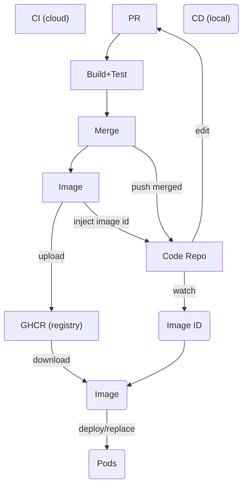

# DevSecOps Simple
A DevSecOps "Hello World!" project.


## CI/CD Workflow



## Setup for WSL Ubuntu
**On Windows**
Install [Docker Desktop](https://docs.docker.com/desktop/setup/install/windows-install/) and
- Go to Settings > General and ensure "Use the WSL 2 based engine" is checked.
- Go to Settings > Resources > WSL Integration and toggle the switch for your Ubuntu distro.

**In WSL Ubuntu**
```shell
# Install Ansible
pip install ansible

# Install Containerization Tools using Ansible
ansible-playbook -K setup/sys_wsl.yml

# Bootstrap the cluster
ansible-playbook bootstrap.yml
```


## Run Application

Test [Application API](http://localhost:30080/) in browser  

Explore [ArgoCD Web UI](https://localhost:30443) (requires login)

**username / password** 
```
admin
```
```
kubectl -n argocd get secret argocd-initial-admin-secret -o jsonpath="{.data.password}" | base64 -d; echo
```


## Useful
```shell
# Check Ubuntu Version
hostnamectl

# Ansible dry runs
ansible-playbook [--check | --list-tasks | --syntax-check] <playbook>.yml
ansible-lint <playbook>.yml

# Terraform
cd terraform
terraform providers
terraform show

# Infrastructure
kubectl get nodes
kubectl get svc
kubectl get all -n argocd

# Application
kubectl get pods -n default
kubectl describe pod dummy-app

# ArgoCD
kubectl get svc -n argocd

# ArgoCD password
kubectl -n argocd get secret argocd-initial-admin-secret -o jsonpath="{.data.password}" | base64 -d; echo
```


## TODO
- Containerize local dev env
- Cluster *tear down* playbook
- Security checks


## FIX
- Eliminate ouble commits on merge to `main` branch
- Allow direct push for `dev` branch
- Remove temp files created by `terraform`
- Skip image builds for non-application code changes
